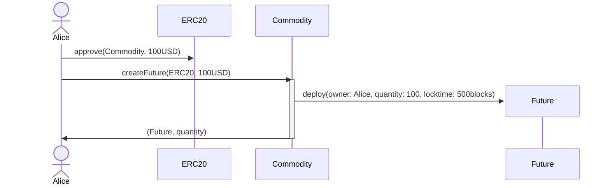
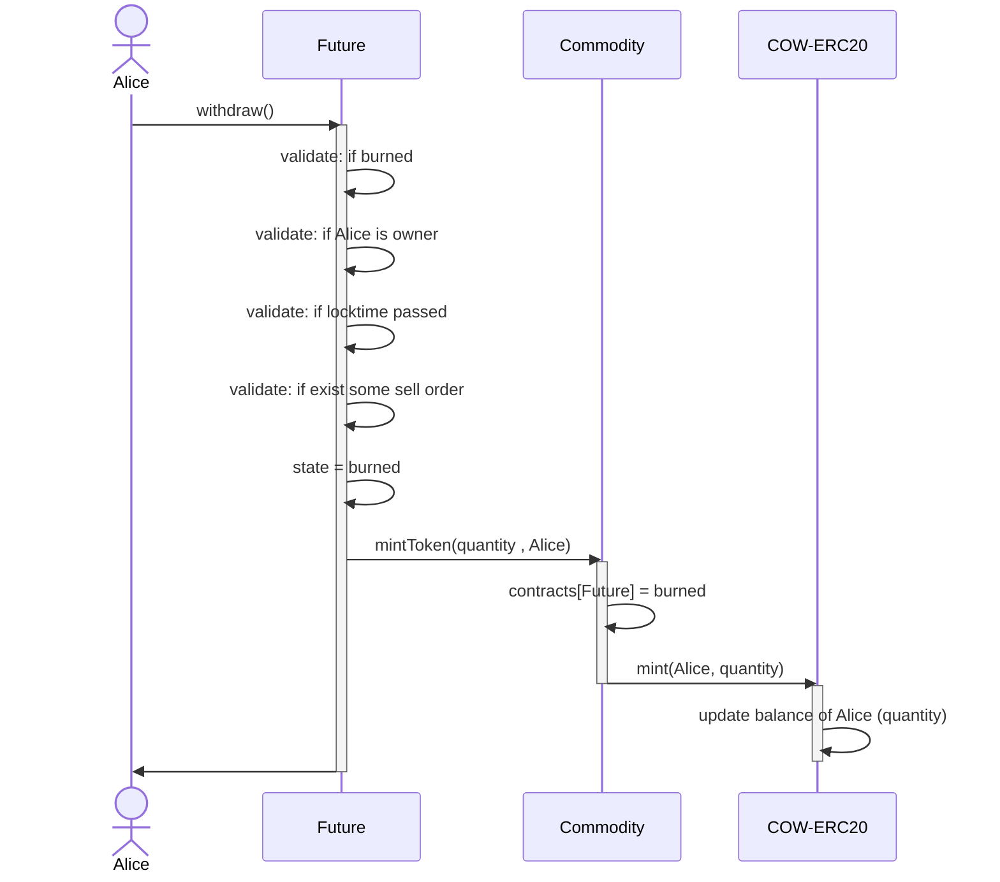
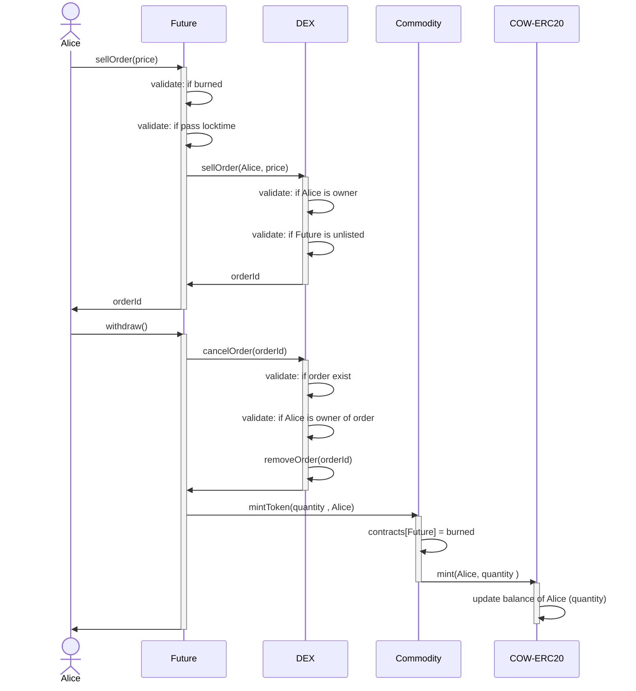
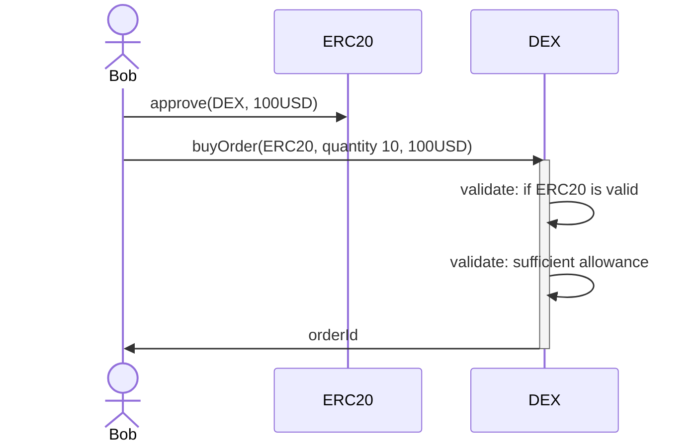
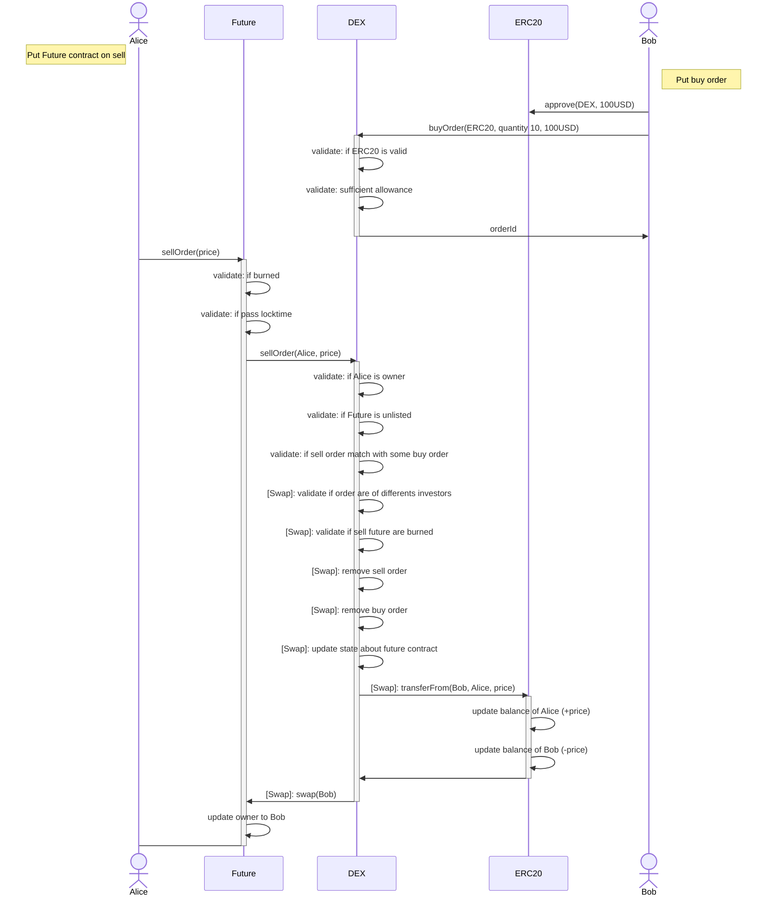

## Crate new Futures contract

```mermaid
sequenceDiagram

actor Alice
participant ERC20
participant Commodity


Alice->>ERC20: approve(Commodity, 100USD)
Alice->>Commodity: createFuture(ERC20, 100USD)
activate Commodity
create participant Future

Commodity->>Future: deploy(owner: Alice, quantity: 100, locktime: 500blocks)
Commodity->>Alice: (Future, quantity)
deactivate Commodity
```

---

## Withdraw Futures

```mermaid
sequenceDiagram

actor Alice
participant Future
participant Commodity
participant COW-ERC20

Alice->>Future: withdraw()

activate Future
Future->>Future: validate: if burned
Future->>Future: validate: if Alice is owner
Future->>Future: validate: if locktime passed
Future->>Future: validate: if exist some sell order
Future->>Future: state = burned
Future->>Commodity: mintToken(quantity , Alice)

activate Commodity
Commodity->>Commodity: contracts[Future] = burned
Commodity->>COW-ERC20: mint(Alice, quantity)
deactivate Commodity

activate COW-ERC20
COW-ERC20->>COW-ERC20: update balance of Alice (quantity)
deactivate COW-ERC20

Future->>Alice:
deactivate Future
```

---

## Sell Future order

```mermaid
sequenceDiagram

actor Alice
participant Future
participant DEX
participant Commodity
participant COW-ERC20

Alice->>Future: sellOrder(price)

activate Future
Future->>Future: validate: if burned
Future->>Future: validate: if pass locktime
Future->>DEX: sellOrder(Alice, price)

activate DEX
DEX->>DEX: validate: if Alice is owner
DEX->>DEX: validate: if Future is unlisted
DEX->>Future: orderId
deactivate DEX

Future->>Alice: orderId
deactivate Future

Alice->>Future: withdraw()
activate Future
Future->>DEX: cancelOrder(orderId)

activate DEX
DEX->>DEX: validate: if order exist
DEX->>DEX: validate: if Alice is owner of order
DEX->>DEX: removeOrder(orderId)
DEX->>Future:
deactivate DEX

Future->>Commodity: mintToken(quantity , Alice)

activate Commodity
Commodity->>Commodity: contracts[Future] = burned
Commodity->>COW-ERC20: mint(Alice, quantity )
deactivate Commodity

activate COW-ERC20
COW-ERC20->>COW-ERC20: update balance of Alice (quantity)
deactivate COW-ERC20

Future->>Alice:
deactivate Future
```

## Buy order

```mermaid
sequenceDiagram

actor Bob
participant ERC20
participant DEX

Bob->>ERC20: approve(DEX, 100USD)
Bob->>DEX: buyOrder(ERC20, quantity 10, 100USD)

activate DEX
DEX->>DEX: validate: if ERC20 is valid
DEX->>DEX: validate: sufficient allowance
DEX->>Bob: orderId
deactivate DEX
```

---

## Match Orders

```mermaid
sequenceDiagram

actor Alice
participant Future
participant DEX
participant ERC20
actor Bob

note left of Alice: Put Future contract on sell
note right of Bob: Put buy order

Bob->>ERC20: approve(DEX, 100USD)
Bob->>DEX: buyOrder(ERC20, quantity 10, 100USD)
activate DEX
DEX->>DEX: validate: if ERC20 is valid
DEX->>DEX: validate: sufficient allowance
DEX->>Bob: orderId
deactivate DEX


Alice->>Future: sellOrder(price)
activate Future

Future->>Future: validate: if burned
Future->>Future: validate: if pass locktime
Future->>DEX: sellOrder(Alice, price)
activate DEX

DEX->>DEX: validate: if Alice is owner
DEX->>DEX: validate: if Future is unlisted
DEX->>DEX: validate: if sell order match with some buy order
DEX->>DEX: [Swap]: validate if order are of differents investors
DEX->>DEX: [Swap]: validate if sell future are burned
DEX->>DEX: [Swap]: remove sell order
DEX->>DEX: [Swap]: remove buy order
DEX->>DEX: [Swap]: update state about future contract
DEX->>ERC20: [Swap]: transferFrom(Bob, Alice, price)

activate ERC20
ERC20->>ERC20: update balance of Alice (+price)
ERC20->>ERC20: update balance of Bob (-price)
ERC20->>DEX:
deactivate ERC20

DEX->>Future: [Swap]: swap(Bob)
deactivate DEX

Future->>Future: update owner to Bob
Future->Alice:
deactivate Future
```

---

## Put order type of Commodities

## Wrapper COW
